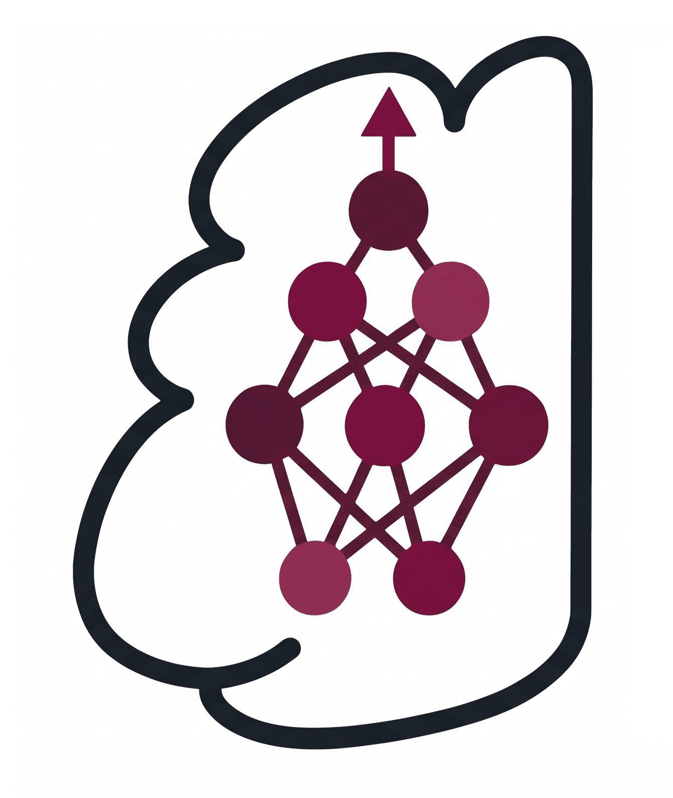
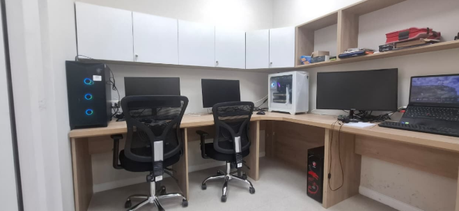

#  Bienvenido al Repositorio de LIA UPCH
<!-- {: width="300"}  Optional: add your logo -->

El Laboratorio de Inteligencia Artificial de la Facultad de Ciencias e Ingeniería de la Universidad Peruana Cayetano Heredia (LIA-UPCH) se constituye como un espacio de investigación, formación y desarrollo en tecnologías emergentes. Su misión es potenciar el trabajo académico como tesis y proyectos de investigación de la facultad mediante el acceso a recursos de cómputo de alto rendimiento, orientados principalmente al diseño, entrenamiento y despliegue de modelos de inteligencia artificial aplicados a la salud.

El laboratorio impulsa proyectos basados en modelos fundacionales y Large Language Models (LLM) open-weight, visión por computadora y procesamiento de señales. 

---

# Recursos computacionales

Nuestros recursos tienen el nombre de Hinton&Hopfield  en honor a los científicos ganadores del Premio Nobel de Física 2024 por sus contribuciones a la IA y física.

Actualmente estos recursos se agrupan de la siguiente forma:
- 1era PC: llamada HINTON I, cuyos recursos computacionales son:
  - GPU:  1 RTX A6000 de 49GB de VRAM.
  - Memoria RAM: 32 GB DDR5
  - Espacio de almacenamiento: 1TB
  - CPU: core i9
- 2da PC: llamada HINTON II, 2 RTX A6000 de 49GB de GPU, total 98GB GPU
  - GPU:  2 RTX A6000 de 49 GB de VRAM c/u, total: 98 GB VRAM.
  - Memoria RAM: 128 GB DDR5
  - Espacio de almacenamiento: 6 TB
  - CPU: core i9

## Espacio de trabajo

  

---

Nos encontramos físicamente en el Laboratorio 113-1 del LID, en un ambiente cómodo  con espacio de trabajo para 7 usuarios con conexión a puntos de RED independientes. En este laboratorio se encuentran las Hinton&Holpfield.

---

  

---
Made with ❤️ by [LIA-UPCH]
